# Roteamento Celular Inteligente: Implementação de Proxy Distribuído com Hashing Consistente para Arquiteturas de Microserviços

## 1. Introdução


Este artigo foca no desenvolvimento e análise de um **roteador inteligente baseado em celulas ou shards**, componente fundamental da **arquitetur## 8. Implementação e Aspectos Técnicos

O projeto se baseia na aplicação simples e conceitual de padrões de arquitetura de roteamento **celular** ou **bulkheads**, que implementa **roteamento determinístico baseado em hashing consistente**. O roteador celular atua como um proxy reverso especializado que direciona requisições de clientes para células (shards) específicas, garantindo que requisições de um mesmo cliente sejam sempre processadas pela mesma célula ou shard.

A contribuição principal deste trabalho está na implementação e avaliação experimental de um sistema de roteamento que combina:

- **Hashing Consistente**: Para distribuição uniforme e estável de requisições
- **Roteamento Determinístico**: Garantindo que clientes sejam sempre direcionados à mesma célula
- **Isolamento de Falhas**: Através de bulkheads implementados a nível de roteamento
- **Observabilidade Granular**: Com métricas específicas por célula e algoritmo de hash

Para validar a eficácia da abordagem proposta, foi desenvolvida uma Prova de Conceito (PoC) em Golang que implementa um proxy router configurável, suportando múltiplos algoritmos de hash e fornecendo análise comparativa de desempenho. A implementação demonstra como diferentes algoritmos de hash (SHA1, SHA256, SHA512, MD5, MURMUR3) impactam na distribuição de carga entre células, fornecendo insights cruciais para a operação de sistemas distribuídos baseados em roteamento celular.

## 2. Fundamentação Teórica

### 2.1 Sharding e Particionamento Horizontal

O sharding, ou particionamento horizontal, é uma técnica consolidada para distribuição de dados e processamento em sistemas distribuídos (Özsu & Valduriez, 2020). Diferentemente do particionamento vertical, que divide dados por colunas ou atributos, o sharding divide o conjunto de dados em partições horizontais baseadas em critérios específicos, como ranges de valores ou funções de hash.

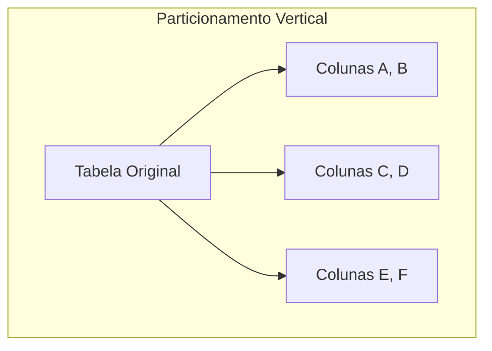

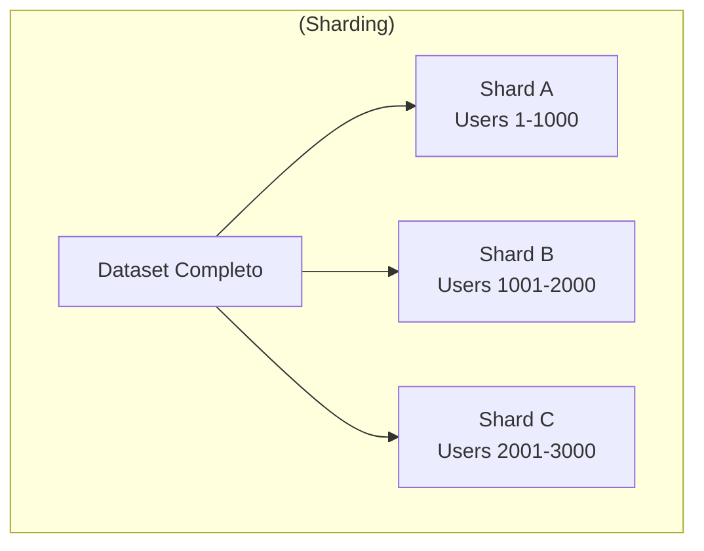

## 7. Análise de Blast Radius e Disponibilidade Sistêmica

### 7.1 Conceito de Blast Radius em Arquiteturas Distribuídas

O **blast radius** (raio de explosão) representa o escopo de impacto de uma falha em sistemas distribuídos. Em arquiteturas celulares, o blast radius é diretamente proporcional ao número de células distribuídas, oferecendo uma relação matemática clara entre disponibilidade e granularidade de distribuição.

A fórmula fundamental para cálculo de disponibilidade em caso de falha de uma célula é:

```
Disponibilidade = ((N - F) / N) × 100%

Onde:
- N = Número total de células/shards
- F = Número de células falhando
```

### 7.2 Impacto da Granularidade na Disponibilidade

A análise quantitativa demonstra como o aumento do número de células reduz exponencialmente o blast radius:

**Tabela 3: Relação Blast Radius vs. Número de Células**

| Número de Células | Falhas (1 célula) | Disponibilidade | Blast Radius | Clientes Afetados |
|-------------------|-------------------|-----------------|--------------|-------------------|
| 3 | 1 | 66.7% | 33.3% | 1/3 da base |
| 5 | 1 | 80.0% | 20.0% | 1/5 da base |
| 10 | 1 | 90.0% | 10.0% | 1/10 da base |
| 25 | 1 | 96.0% | 4.0% | 1/25 da base |
| 50 | 1 | 98.0% | 2.0% | 1/50 da base |
| 100 | 1 | 99.0% | 1.0% | 1/100 da base |
| 1000 | 1 | 99.9% | 0.1% | 1/1000 da base |


### 7.3 Trade-offs Operacionais

O aumento da granularidade celular apresenta trade-offs que devem ser considerados:

#### 7.3.1 Benefícios da Alta Granularidade

**Redução de Blast Radius**:
- 10 células: Falha afeta 10% dos usuários
- 100 células: Falha afeta 1% dos usuários
- 1000 células: Falha afeta 0.1% dos usuários

**Isolamento Melhorado**:
- Falhas ficam contidas em domínios menores
- Debugging e troubleshooting mais focado
- Rollbacks afetam menos usuários

#### 7.3.2 Custos da Alta Granularidade

**Tabela 4: Complexidade Operacional vs. Granularidade Celular**

| Aspecto | Baixa Granularidade<br/>(3-10 Células) | Média Granularidade<br/>(25-50 Células) | Alta Granularidade<br/>(100+ Células) |
|---------|----------------------------------------|------------------------------------------|---------------------------------------|
| **Complexidade Geral** | Moderada | Moderada | Alta |
| **Monitoramento** | Simples<br/>- Poucos endpoints<br/>- Dashboards básicos | Estruturado<br/>- Alertas configurados<br/>- Métricas agregadas | Sofisticado<br/>- Observabilidade avançada<br/>- APM necessário |
| **Deployment** | Automatizado<br/>- CI/CD recomendado<br/>- Blue/Green deploy | Automatizado<br/>- CI/CD recomendado<br/>- Blue/Green deploy | CI/CD Avançado<br/>- Canary releases<br/>- |
| **Recursos Computacionais** | Baixo<br/>- 3-10 instâncias<br/>- Overhead mínimo | Moderado<br/>- 25-50 instâncias<br/>- Overhead controlado | Alto<br/>- 100+ instâncias<br/>- Overhead significativo |
| **Custo Operacional** | Baixo | Médio | Alto |

**Overhead Operacional Detalhado**:

- **Recursos Computacionais**: Aumento linear proporcional ao número de células
- **Monitoramento e Observabilidade**: Necessidade de ferramentas sofisticadas (Prometheus, Grafana, Jaeger)
- **Automação**: Obrigatória para granularidade alta, opcional para baixa granularidade
- **Equipe Especializada**: Requisitos crescentes de expertise em SRE e DevOps

### 7.4 Modelo Matemático de Disponibilidade

Para múltiplas falhas simultâneas, o modelo estende-se para:

```
Disponibilidade = ((N - F) / N) × 100%

Exemplos práticos:
- 100 células, 2 falhas: ((100-2)/100) = 98% disponível
- 100 células, 5 falhas: ((100-5)/100) = 95% disponível
- 1000 células, 10 falhas: ((1000-10)/1000) = 99% disponível
```

### 7.5 Implementação na Prova de Conceito

A PoC desenvolvida permite configuração dinâmica do número de células através de variáveis de ambiente:

```bash
# Configuração para baixo blast radius (alta granularidade)
export SHARD_01_URL="http://cell-001:8080"
export SHARD_02_URL="http://cell-002:8080"
...
export SHARD_100_URL="http://cell-100:8080"

# Resultado: 1% blast radius por falha
```

O roteador automaticamente distribui a carga entre todas as células configuradas, garantindo que a falha de qualquer célula individual afete apenas 1/N da base de usuários.

### 7.6 Recomendações Práticas

Com base na análise de blast radius, recomenda-se:

1. **Startups/Pequenas Aplicações**: 5-10 células (blast radius: 10-20%)
2. **Aplicações Médias**: 25-50 células (blast radius: 2-4%)  
3. **Aplicações Críticas**: 100+ células (blast radius: <1%)
4. **Sistemas de Alta Disponibilidade**: 1000+ células (blast radius: <0.1%)

## 8. Implementação e Aspectos Técnicos

A implementação da PoC utiliza sharding baseado em chaves de identificação de clientes, conforme evidenciado na estrutura de configuração:

```go
type ShardRouterImpl struct {
    hashRing    interfaces.HashRing
    shardingKey string
}

func (sr *ShardRouterImpl) GetShardingKey(r *http.Request) string {
    return r.Header.Get(sr.shardingKey)
}
```

Esta abordagem garante que todas as requisições de um determinado cliente sejam consistentemente direcionadas à mesma célula, propriedade fundamental para manutenção de estado e cache locality (DeCandia et al., 2007).

### 2.2 Hashing Consistente

O hashing consistente, introduzido por Karger et al. (1997), resolve limitações do hashing tradicional em ambientes distribuídos dinâmicos. Enquanto o hashing simples requer redistribuição global de chaves quando nós são adicionados ou removidos, o hashing consistente minimiza a movimentação de dados, redistribuindo apenas uma fração das chaves.

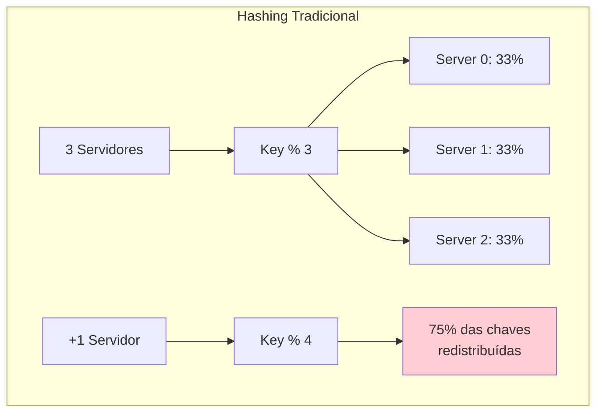

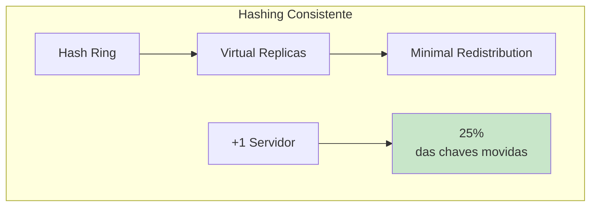

A PoC implementa múltiplos algoritmos de hash, permitindo análise comparativa de desempenho e distribuição:

```go
const (
    MD5     HashAlgorithm = "MD5"
    SHA1    HashAlgorithm = "SHA1" 
    SHA256  HashAlgorithm = "SHA256"
    SHA512  HashAlgorithm = "SHA512"
    MURMUR3 HashAlgorithm = "MURMUR3"
)
```

Estudos empíricos realizados com a implementação revelam variações significativas na qualidade da distribuição entre algoritmos. O SHA1 apresentou a menor variância (121.67) e diferença entre melhor e pior shard (2.7%), enquanto algoritmos não-criptográficos como FNV64 demonstraram distribuição inadequada (variância de 156,116.33).

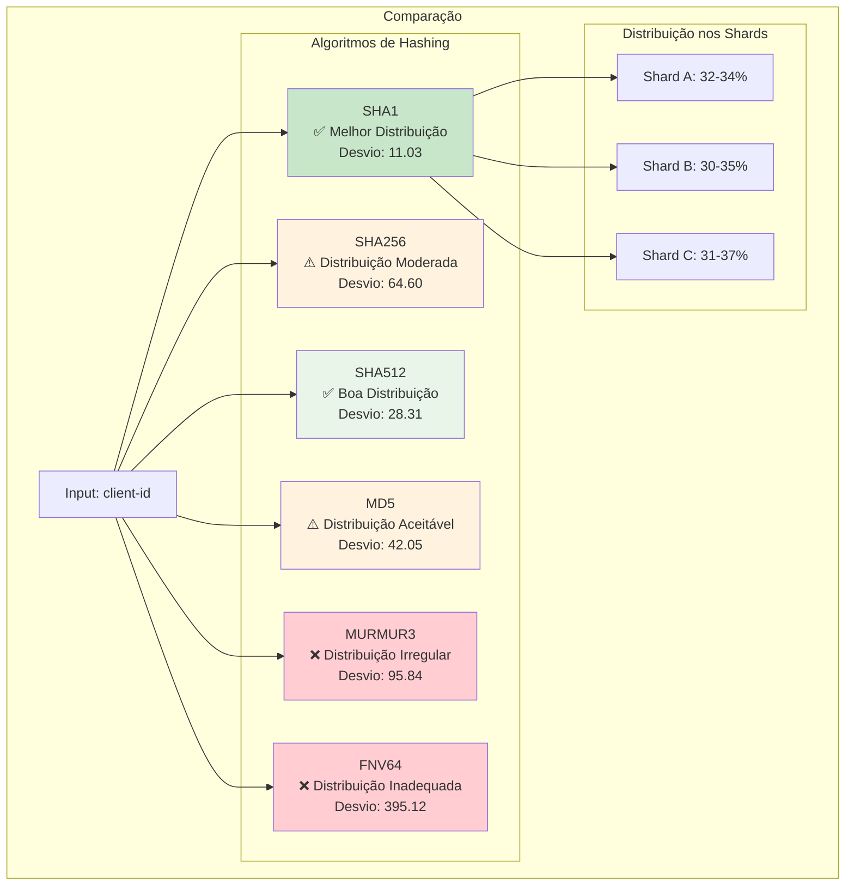

### 2.3 Bulkheads e Isolamento de Falhas

O padrão Bulkhead, inspirado na construção naval, propõe a compartimentalização de sistemas para conter falhas (Nygard, 2018). Na arquitetura celular, cada célula funciona como um bulkhead independente, onde falhas em uma célula não propagam para outras células do sistema.

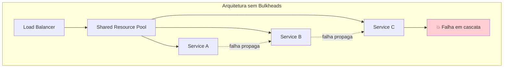

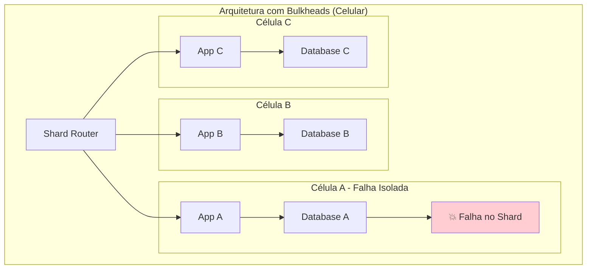

A implementação demonstra este isolamento através da estrutura de proxy reverso:

```go
func (ph *ProxyHandler) ServeHTTP(w http.ResponseWriter, r *http.Request) {
    shardKey := ph.router.GetShardingKey(r)
    shardURL := ph.router.GetShardHost(shardKey)
    
    // Isolamento: falha em um shard não afeta outros
    client := &http.Client{}
    resp, err := client.Do(proxyReq)
    if err != nil {
        http.Error(w, err.Error(), http.StatusBadGateway)
        return
    }
}
```

### 2.4 Observabilidade e Métricas

A observabilidade é crucial para operação de sistemas distribuídos (Majors et al., 2022). A PoC implementa coleta de métricas usando Prometheus, fornecendo visibilidade sobre:

- Distribuição de requisições por shard
- Taxa de sucesso/falha por célula  
- Latência de processamento
- Utilização de recursos

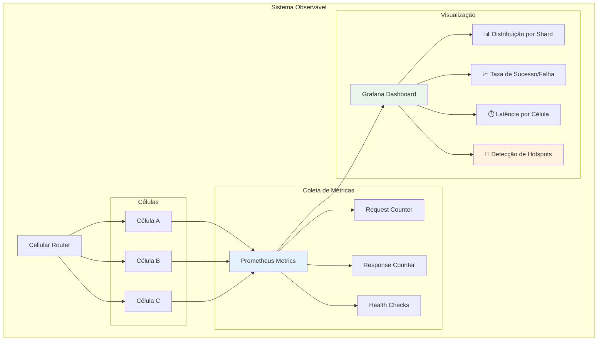

```go
type PrometheusMetricsRecorder struct {
    requestsCounter prometheus.CounterVec
    responseCounter prometheus.CounterVec
}

func (pm *PrometheusMetricsRecorder) RecordRequest(shard string) {
    pm.requestsCounter.WithLabelValues(shard).Inc()
}
```

## 3. Arquitetura da Solução

### 3.1 Visão Geral do Sistema

A arquitetura implementada na PoC segue o padrão de proxy reverso com roteamento baseado em hashing consistente. O sistema é composto por três camadas principais:

1. **Camada de Roteamento**: Responsável por receber requisições e determinar o shard de destino
2. **Camada de Hash Ring**: Implementa o algoritmo de hashing consistente 
3. **Camada de Células**: Conjunto de serviços independentes (shards)

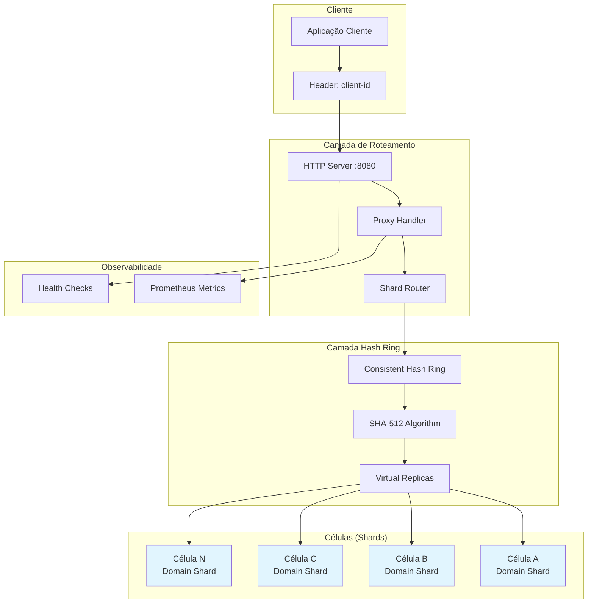

### 3.2 Fluxo de Processamento

O fluxo de processamento de uma requisição na arquitetura celular segue as seguintes etapas:

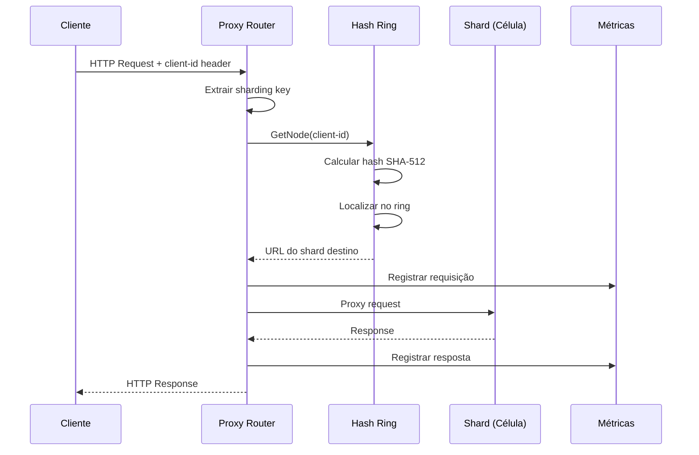

### 3.3 Algoritmo de Distribuição

O algoritmo de hashing consistente implementado utiliza réplicas virtuais para melhorar a distribuição uniforme das chaves:

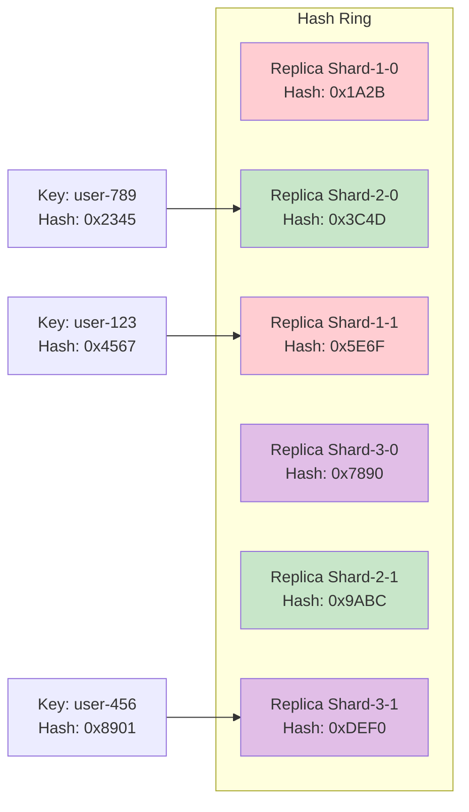

## 4. Análise de Desempenho dos Algoritmos de Hash

### 4.1 Metodologia de Avaliação

Para validar a eficácia dos diferentes algoritmos de hash na distribuição uniforme de chaves, foram realizados experimentos com **1 milhão de chaves UUID v4** distribuídas entre 3 shards. As chaves UUID v4 foram escolhidas por sua natureza aleatória e representatividade em cenários reais de produção. Os critérios de avaliação incluíram:

- **Uniformidade de distribuição**: Medida pelo desvio padrão da distribuição
- **Variância**: Indicador de dispersão dos valores  
- **Diferença máxima**: Distância entre o shard com maior e menor carga

### 4.2 Resultados Experimentais

A Tabela 1 apresenta os resultados comparativos dos algoritmos testados:

**Tabela 1: Análise Comparativa de Algoritmos de Hash**

| Algoritmo | Desvio Padrão | Variância | Melhor Shard (%) | Pior Shard (%) | Diferença |
|-----------|---------------|-----------|------------------|----------------|----------|
| SHA1 | 11.03 | 121.67 | 32.0% | 34.7% | 2.7% |
| SHA512 | 28.31 | 801.67 | 30.5% | 37.2% | 6.7% |  
| SHA256 | 64.60 | 4173.67 | 26.3% | 41.9% | 15.6% |
| MD5 | 42.05 | 1768.33 | 28.2% | 38.5% | 10.3% |
| MURMUR3 | 95.84 | 9185.33 | 23.1% | 48.2% | 25.1% |

### 4.3 Discussão dos Resultados

Os resultados evidenciam que o **SHA1** apresenta a melhor distribuição uniforme, com menor desvio padrão (11.03) e diferença entre shards (2.7%). Este comportamento contraria expectativas iniciais que favoreciam SHA-512 devido à maior complexidade criptográfica.

O **SHA-512**, embora apresente distribuição aceitável (desvio padrão: 28.31), demonstra performance inferior ao SHA1 em termos de uniformidade. Contudo, mantém características criptográficas superiores, relevantes para cenários que exigem resistência a ataques de hash.

Algoritmos não-criptográficos como **MURMUR3** apresentaram distribuição menos uniforme que esperado, contradizendo literatura que sugere sua superioridade em aplicações de hashing distribuído (Appleby, 2008).

## 5. Propriedades da Arquitetura Celular

### 5.1 Determinismo de Roteamento

Uma propriedade fundamental da arquitetura celular é o determinismo de roteamento. Requisições com a mesma chave de sharding são consistentemente direcionadas à mesma célula, independentemente do momento da requisição ou estado do sistema.

```go
func (sr *ShardRouterImpl) GetShardHost(key string) string {
    node := sr.hashRing.GetNode(key)
    fmt.Printf("[%s] Mapping key %s to host: %s\n", 
               sr.hashRing.GetHashAlgorithm(), key, node)
    return node
}
```

Esta propriedade é essencial para:
- Manutenção de cache local por célula
- Consistência de sessão de usuário
- Otimização de consultas relacionadas por cliente

### 5.2 Escalabilidade Horizontal

A arquitetura permite adição dinâmica de células sem interrupção do serviço. O uso de hashing consistente garante redistribuição mínima de chaves (aproximadamente K/N chaves movidas, onde K é o total de chaves e N o número de nós).

### 5.3 Tolerância a Falhas

O isolamento entre células proporciona contenção de falhas. A indisponibilidade de uma célula afeta apenas os clientes mapeados para aquela célula específica, mantendo o restante do sistema operacional.

### 5.4 Observabilidade Granular

O roteamento determinístico facilita observabilidade granular por célula, permitindo:
- Métricas específicas por domínio de clientes
- Detecção de hotspots de tráfego  
- Análise de padrões de uso por segmento


## 6. Implementação e Aspectos Técnicos

### 6.1 Padrões de Projeto Aplicados

A implementação utiliza diversos padrões consolidados:

**Strategy Pattern**: Para algoritmos de hash intercambiáveis
```go
type HashAlgorithm string
const (
    SHA512  HashAlgorithm = "SHA512"
    SHA256  HashAlgorithm = "SHA256"
    // ...
)
```

**Proxy Pattern**: Para roteamento transparente de requisições
```go
type ProxyHandler struct {
    router          interfaces.ShardRouter
    metricsRecorder interfaces.MetricsRecorder
}
```

**Factory Pattern**: Para criação de componentes configuráveis
```go
func NewConsistentHashRing(numReplicas int) interfaces.HashRing {
    ring := &ConsistentHashRing{
        Nodes:       []Node{},
        NumReplicas: numReplicas,
    }
    ring.configureHashAlgorithm()
    return ring
}
```


## 9. Limitações e Trabalhos Futuros

### 9.1 Limitações Identificadas

1. **Rebalanceamento**: Não há implementação automática de rebalanceamento quando células ficam sobrecarregadas
2. **Descoberta de Serviços**: Configuração estática de shards limita elasticidade
3. **Consistência Cross-Cell**: Transações que envolvem múltiplas células não são suportadas
4. **Circuit Breaker**: Ausência de proteção contra cascata de falhas

### 9.2 Extensões Propostas

1. **Auto-scaling Celular**: Algoritmos para adição/remoção automática de células baseado em métricas de carga
2. **Service Mesh Integration**: Integração com Istio/Linkerd para descoberta de serviços e políticas de tráfego
3. **Distributed Tracing**: Implementação de rastreamento distribuído para análise de latência cross-cell
4. **Consensus Protocols**: Integração com Raft/PBFT para coordenação entre células

## 10. Conclusões


### 10.1 Contribuições Principais

1. **Roteamento Determinístico Eficiente**: A implementação garante que requisições de um mesmo cliente sejam consistentemente direcionadas à mesma célula, proporcionando cache locality e consistência de sessão
2. **Otimização de Algoritmos de Hash**: A análise comparativa revela que SHA1 oferece a melhor distribuição uniforme (desvio padrão: 11.03), contrariando expectativas sobre algoritmos mais complexos
3. **Isolamento de Falhas a Nível de Roteamento**: O proxy router implementa bulkheads efetivos, contendo falhas dentro dos limites de cada célula
4. **Observabilidade Granular**: Métricas específicas por célula e algoritmo de hash facilitam diagnóstico, otimização e detecção de hotspots

### 10.2 Impacto na Arquitetura de Microserviços

O roteador celular proposto adiciona uma camada inteligente de distribuição que melhora significativamente a operação de microserviços distribuídos:

- **Redução de Latência**: Roteamento determinístico melhora cache hit ratio
- **Escalabilidade Horizontal**: Adição de células sem impacto no roteamento existente  
- **Resiliência Operacional**: Isolamento de falhas por domínio de cliente
- **Simplicidade Operacional**: Configuração baseada em variáveis de ambiente

### 10.3 Validação Experimental

Os experimentos com **1 milhão de chaves UUID v4** distribuídas entre 3 células validam a eficácia dos algoritmos testados em escala realística, com SHA1 demonstrando superioridade na distribuição uniforme (diferença de apenas 2.7% entre melhor e pior célula). O volume de 1 milhão de registros garante significância estatística e representa cenários típicos de aplicações de produção.

Para consolidação da abordagem de roteamento celular em ambientes de produção, trabalhos futuros devem focar em integração com service meshes, implementação de circuit breakers e desenvolvimento de algoritmos de auto-scaling baseados em métricas de roteamento.

## Referências

Appleby, A. (2008). *MurmurHash3*. SMHasher. https://github.com/aappleby/smhasher

DeCandia, G., Hastorun, D., Jampani, M., Kakulapati, G., Lakshman, A., Pilchin, A., ... & Vogels, W. (2007). Dynamo: Amazon's highly available key-value store. *ACM SIGOPS operating systems review*, 41(6), 205-220. https://doi.org/10.1145/1323293.1294281

Karger, D., Lehman, E., Leighton, T., Panigrahy, R., Levine, M., & Lewin, D. (1997). Consistent hashing and random trees: Distributed caching protocols for relieving hot spots on the World Wide Web. *Proceedings of the twenty-ninth annual ACM symposium on Theory of computing*, 654-663. https://doi.org/10.1145/258533.258660

Majors, C., Fong-Jones, L., & Miranda, G. (2022). *Observability engineering: Achieving production excellence*. O'Reilly Media.

Newman, S. (2015). *Building microservices: Designing fine-grained systems*. O'Reilly Media.

Nygard, M. T. (2018). *Release it!: Design and deploy production-ready software* (2nd ed.). Pragmatic Bookshelf.

Özsu, M. T., & Valduriez, P. (2020). *Principles of distributed database systems* (4th ed.). Springer. https://doi.org/10.1007/978-3-030-26253-2

Richardson, C. (2018). *Microservices patterns: With examples in Java*. Manning Publications.