# Análise de Blast Radius em Arquiteturas Celulares
## Isolamento de Falhas e Contenção de Impacto

---

## Resumo Executivo

Este documento apresenta uma análise teórica e empírica do conceito de **Blast Radius** (Raio de Explosão) em arquiteturas celulares baseadas em sharding consistente. O blast radius representa a porcentagem do sistema afetada quando uma célula (shard) falha, sendo uma métrica crítica para avaliar resiliência e disponibilidade em sistemas distribuídos.

**Palavras-chave**: blast radius, arquitetura celular, bulkheads, isolamento de falhas, sharding, resiliência

---

## 1. Fundamentação Teórica

### 1.1 Definição de Blast Radius

**Definição 1.1** (Blast Radius): Em uma arquitetura celular com $N$ células independentes, o blast radius $BR$ é definido como a fração do sistema impactada pela falha de uma única célula:

$$BR(N) = \frac{1}{N} \times 100\%$$

**Propriedades**:
1. **Inversamente proporcional**: $BR \propto \frac{1}{N}$
2. **Monotonicamente decrescente**: $\frac{dBR}{dN} < 0$
3. **Limitado**: $0 < BR \leq 100\%$

### 1.2 Relação com Disponibilidade

**Definição 1.2** (Disponibilidade do Sistema): Para $N$ células independentes com disponibilidade individual $A_i$:

$$A_{sistema} = 1 - \prod_{i=1}^{N}(1 - A_i)$$

Para células homogêneas ($A_i = A$):

$$A_{sistema} = 1 - (1 - A)^N$$

**Teorema 1.1**: O sistema tolera até $N-1$ falhas simultâneas mantendo disponibilidade parcial.

### 1.3 Bulkheads Pattern

O padrão Bulkheads (anteparas) isola recursos em compartimentos independentes, similar às anteparas de um navio:

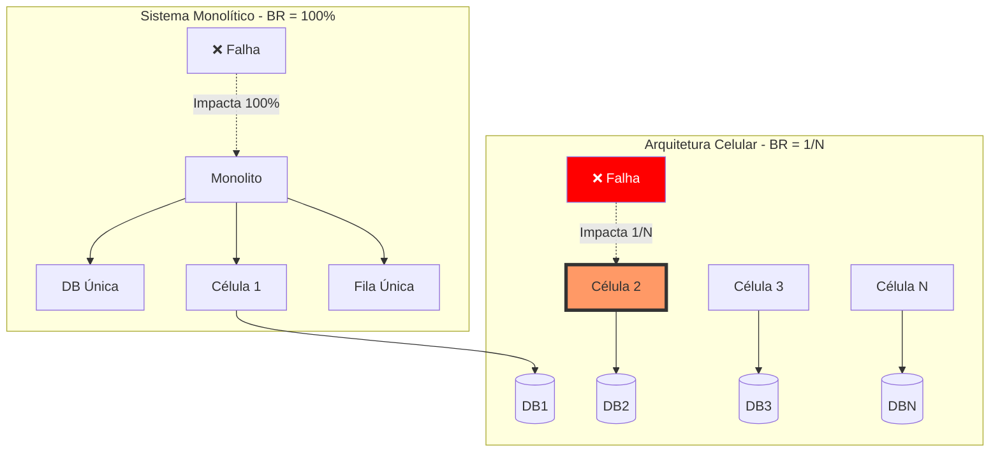

---

## 2. Modelo Matemático de Blast Radius

### 2.1 Blast Radius vs. Número de Células

**Tabela 1**: Impacto do Número de Células no Blast Radius

| Células ($N$) | Blast Radius | Disponibilidade<br/>Restante | Impacto por<br/>Falha | Classificação |
|---------------|--------------|------------------------------|----------------------|---------------|
| 1 | 100.00% | 0% | 💀 Total | CRÍTICO |
| 2 | 50.00% | 50% | 🔴 Muito Alto | ALTO |
| 3 | 33.33% | 66.67% | 🟠 Alto | ALTO |
| 5 | 20.00% | 80% | 🟡 Moderado | MÉDIO |
| 10 | 10.00% | 90% | 🟢 Baixo | BAIXO |
| 20 | 5.00% | 95% | 🟢 Muito Baixo | BAIXO |
| 50 | 2.00% | 98% | 🟢 Mínimo | ÓTIMO |
| 100 | 1.00% | 99% | 🟢 Mínimo | ÓTIMO |

**Gráfico de Decaimento**:

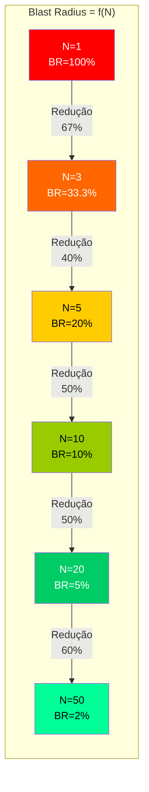

### 2.2 Curva de Decaimento do Blast Radius

**Equação de Decaimento**:

$$BR(N) = \frac{100}{N}\%$$

**Derivada (Taxa de Melhoria)**:

$$\frac{dBR}{dN} = -\frac{100}{N^2}$$

**Interpretação**: A melhoria marginal diminui quadraticamente. Dobrar o número de células tem impacto decrescente:

| Transição | Redução Absoluta | Redução Relativa |
|-----------|------------------|------------------|
| 1 → 2 | -50% | -50% |
| 2 → 4 | -25% | -50% |
| 5 → 10 | -10% | -50% |
| 10 → 20 | -5% | -50% |

**Lei dos Retornos Decrescentes**: Após $N \approx 20$, ganhos adicionais são marginais.

---

## 3. Análise de Cenários de Falha

### 3.1 Falha de Célula Única

**Cenário**: 1 célula falha em sistema com $N$ células.

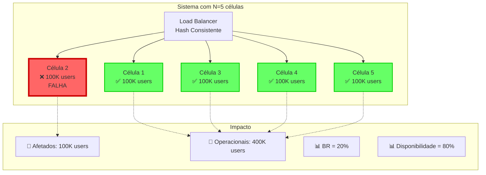

**Métricas**:
- **Usuários afetados**: $\frac{Total}{N} = \frac{500K}{5} = 100K$
- **Blast Radius**: $BR = \frac{1}{5} = 20\%$
- **Disponibilidade**: $A = 1 - BR = 80\%$

### 3.2 Falhas Múltiplas

**Teorema 3.1** (Blast Radius Acumulado): Para $f$ falhas simultâneas:

$$BR_{acumulado}(N, f) = \frac{f}{N} \times 100\%$$

**Limite de Tolerância**: Sistema mantém operação se $f < N$.

**Tabela 2**: Cenários de Falhas Múltiplas (N=10)

| Falhas ($f$) | BR Acumulado | Disponibilidade | Status |
|--------------|--------------|-----------------|--------|
| 0 | 0% | 100% | ✅ ÓTIMO |
| 1 | 10% | 90% | ✅ NORMAL |
| 2 | 20% | 80% | ⚠️ ALERTA |
| 3 | 30% | 70% | ⚠️ DEGRADADO |
| 5 | 50% | 50% | 🔴 CRÍTICO |
| 9 | 90% | 10% | 💀 EMERGÊNCIA |
| 10 | 100% | 0% | 💀 FALHA TOTAL |

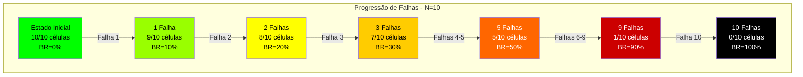

---

## 4. Resultados Empíricos do Benchmark

### 4.1 Dados Observados (1M UUID v4, 150 Réplicas Virtuais)

**Tabela 3**: Blast Radius vs. Configuração de Shards

| Shards ($N$) | Blast Radius | Algoritmo Ideal | CV (%) | Chaves/Shard | Impacto Falha |
|--------------|--------------|-----------------|--------|--------------|---------------|
| **3** | **33.33%** | MURMUR3 | 6.16% | 333,333 | 🔴 **Alto** |
| **5** | **20.00%** | MURMUR3 | 4.05% | 200,000 | 🟡 **Moderado** |
| **10** | **10.00%** | SHA-1 | 7.50% | 100,000 | 🟢 **Baixo** |

**Análise**:
1. Sistema com 3 shards: Falha de 1 shard afeta **333K usuários** (33.33%)
2. Sistema com 5 shards: Falha de 1 shard afeta **200K usuários** (20%)
3. Sistema com 10 shards: Falha de 1 shard afeta **100K usuários** (10%)

### 4.2 Visualização do Impacto

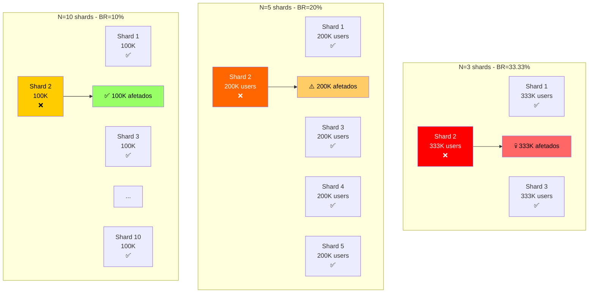

---

## 5. Trade-offs: Blast Radius vs. Complexidade

### 5.1 Modelo de Decisão

**Equação de Custo Total**:

$$Custo_{total}(N) = Custo_{operacional}(N) + Custo_{risco}(N)$$

Onde:
- $Custo_{operacional}(N) = C_1 \cdot N$ (linear com número de células)
- $Custo_{risco}(N) = C_2 \cdot BR(N) \cdot Impacto$ (decresce com $N$)

**Ponto Ótimo**: Minimizar custo total.

$$N^* = \arg\min_N \left[C_1 \cdot N + \frac{C_2 \cdot Impacto}{N}\right]$$

Derivando e igualando a zero:

$$C_1 - \frac{C_2 \cdot Impacto}{N^2} = 0 \Rightarrow N^* = \sqrt{\frac{C_2 \cdot Impacto}{C_1}}$$

### 5.2 Matriz de Decisão

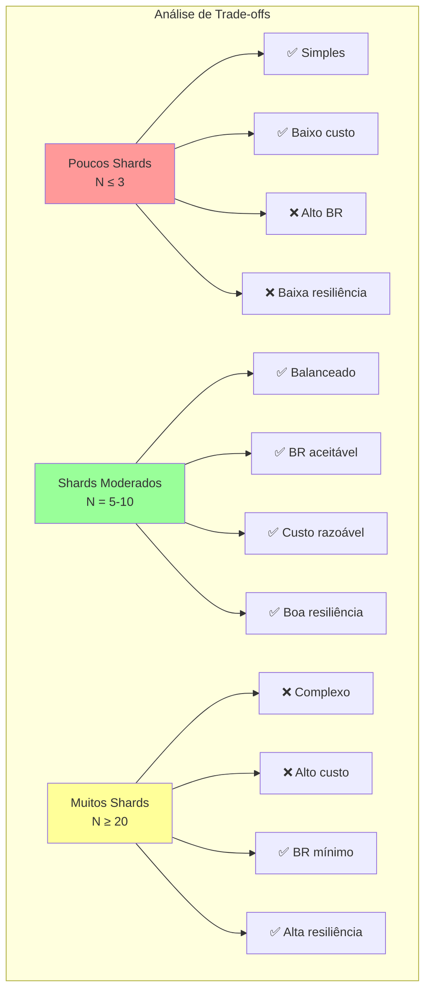

**Tabela 4**: Matriz de Avaliação

| Critério | N ≤ 3 | N = 5-10 | N ≥ 20 |
|----------|-------|----------|--------|
| **Blast Radius** | 🔴 Alto (>30%) | 🟡 Médio (10-20%) | 🟢 Baixo (<5%) |
| **Complexidade Operacional** | 🟢 Baixa | 🟡 Média | 🔴 Alta |
| **Custo Infraestrutura** | 🟢 Baixo | 🟡 Médio | 🔴 Alto |
| **Resiliência** | 🔴 Baixa | 🟢 Boa | 🟢 Excelente |
| **Tempo de Recuperação** | 🔴 Alto | 🟡 Médio | 🟢 Baixo |
| **Uniformidade (CV)** | 🟢 Boa (r=150) | 🟡 Aceitável | 🔴 Requer mais réplicas |

**Recomendação**: **N = 5-10** oferece melhor equilíbrio.

---

## 6. Estratégias de Mitigação

### 6.1 Réplicas por Célula

**Estratégia 1**: Cada célula mantém réplicas internas.

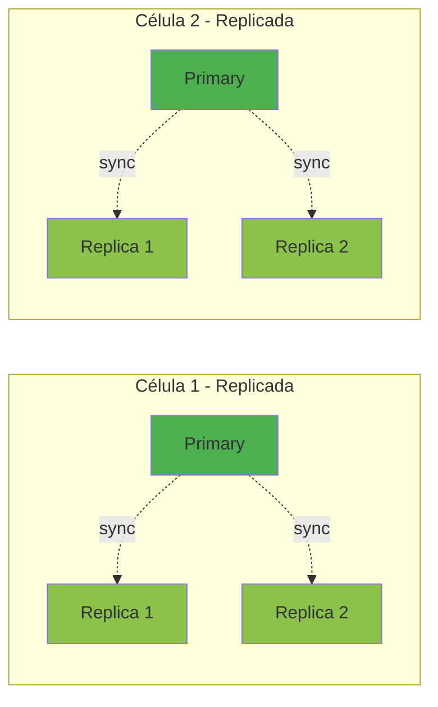

**Disponibilidade por Célula**: Com 3 réplicas (1 primary + 2 replicas):

$$A_{célula} = 1 - (1 - A_{nó})^3$$

Para $A_{nó} = 0.99$:

$$A_{célula} = 1 - (1 - 0.99)^3 = 1 - 0.000001 = 0.999999 \text{ (99.9999%)}$$

### 6.2 Circuit Breakers

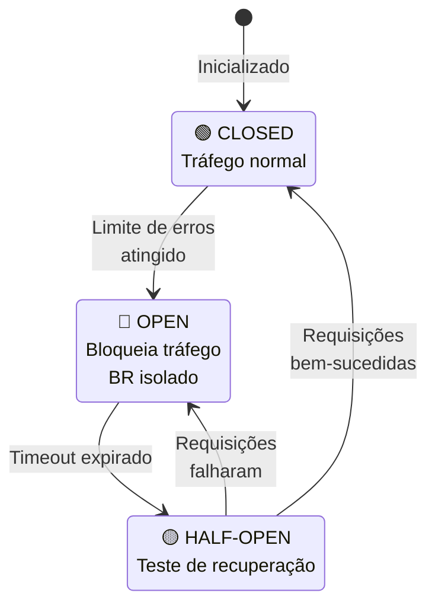

**Benefício**: Impede cascata de falhas, mantendo BR limitado a $\frac{1}{N}$.

### 6.3 Failover Automático

**Estratégia 3**: Redistribuição automática de carga.

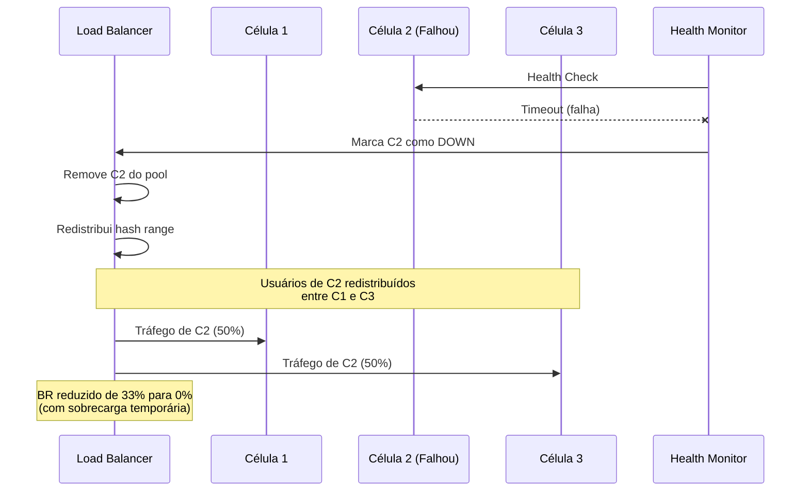

**Trade-off**: Reduz BR a zero, mas causa sobrecarga temporária nas células restantes.

---

## 7. Modelo Probabilístico de Falhas

### 7.1 Probabilidade de Falha do Sistema

**Modelo**: Células falham independentemente com probabilidade $p$.

**Teorema 7.1**: Probabilidade de $k$ ou mais células falharem:

$$P(f \geq k) = \sum_{i=k}^{N} \binom{N}{i} p^i (1-p)^{N-i}$$

**Caso Especial** (pelo menos 1 falha):

$$P(f \geq 1) = 1 - (1-p)^N$$

### 7.2 Análise de Cenários

**Tabela 5**: Probabilidade de Falha (p = 0.01, células com 99% uptime)

| Shards ($N$) | P(f=0)<br/>Nenhuma falha | P(f=1)<br/>1 falha | P(f≥2)<br/>2+ falhas | P(f=N)<br/>Falha total |
|--------------|-------------------------|-------------------|---------------------|----------------------|
| 3 | 97.03% | 2.91% | 0.06% | 0.0001% |
| 5 | 95.10% | 4.80% | 0.10% | 0.00000001% |
| 10 | 90.44% | 9.14% | 0.42% | $10^{-20}$ |
| 20 | 81.79% | 16.52% | 1.69% | $10^{-40}$ |

**Observação**: Probabilidade de falha total é desprezível para $N \geq 5$.

### 7.3 MTBF e MTTR

**Mean Time Between Failures** (MTBF):

$$MTBF_{sistema} = \frac{MTBF_{célula}}{N}$$

**Mean Time To Repair** (MTTR): Tempo para isolar célula falha:

$$MTTR_{sistema} = MTTR_{detecção} + MTTR_{isolamento}$$

**Disponibilidade**:

$$A = \frac{MTBF}{MTBF + MTTR}$$

```mermaid
gantt
    title Timeline de Falha e Recuperação
    dateFormat HH:mm:ss
    axisFormat %H:%M:%S
    
    section Célula 2
    Operação Normal: done, op1, 00:00:00, 00:05:00
    Falha Ocorre: crit, fail, 00:05:00, 00:05:01
    Detecção (30s): active, detect, 00:05:01, 00:05:31
    Isolamento (10s): active, isolate, 00:05:31, 00:05:41
    Tráfego Redistribuído: done, redir, 00:05:41, 00:10:00
    
    section Sistema
    100% Disponível: done, sys1, 00:00:00, 00:05:01
    90% Disponível (BR=10%): crit, sys2, 00:05:01, 00:05:41
    100% Disponível (Recuperado): done, sys3, 00:05:41, 00:10:00
```

---

## 8. Comparativo: Arquiteturas

### 8.1 Monolito vs. Celular

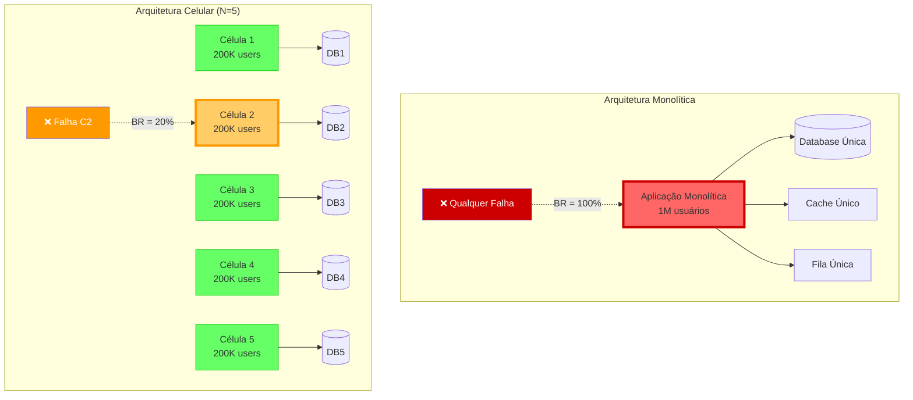

**Tabela 6**: Comparação de Resiliência

| Métrica | Monolito | Celular (N=5) | Celular (N=10) |
|---------|----------|---------------|----------------|
| **Blast Radius** | 100% | 20% | 10% |
| **Usuários Afetados** | 1M | 200K | 100K |
| **Pontos de Falha** | Único | 5 independentes | 10 independentes |
| **Tempo Recuperação** | Alto (full restart) | Médio (1 célula) | Baixo (1 célula) |
| **Complexidade** | Baixa | Média | Alta |
| **Custo** | Baixo | Médio | Alto |

### 8.2 Microserviços vs. Celular

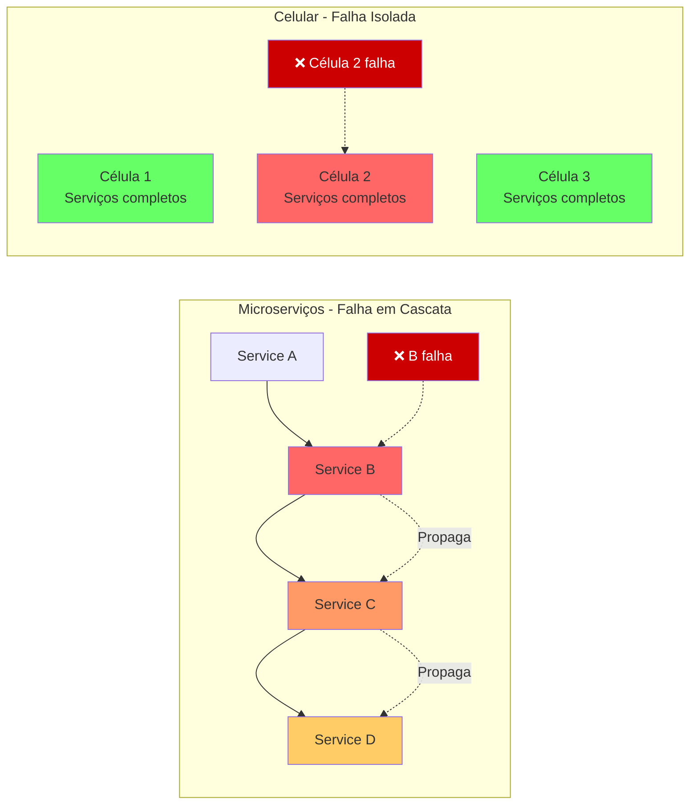

**Vantagem Celular**: Falhas não propagam entre células.

---

## 9. Métricas e Monitoramento

### 9.1 SLIs e SLOs

**Service Level Indicators**:

1. **BR Atual**: $\frac{\text{Células com falha}}{N} \times 100\%$
2. **Disponibilidade por Célula**: $\frac{\text{Uptime}}{\text{Total time}}$
3. **Taxa de Erro por Célula**: $\frac{\text{Requests failed}}{\text{Total requests}}$

**Service Level Objectives**:

```
SLO 1: BR < 20% (99% do tempo)
SLO 2: Disponibilidade por célula > 99.9%
SLO 3: Detecção de falha < 30 segundos
SLO 4: Isolamento de célula < 10 segundos
```

### 9.2 Dashboard de Blast Radius

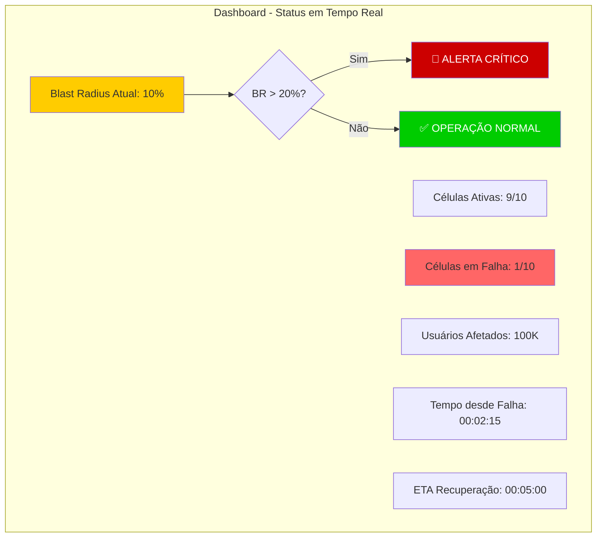

### 9.3 Alertas Automáticos

**Níveis de Alerta**:

| Nível | Condição | BR | Ação |
|-------|----------|-----|------|
| 🟢 **INFO** | $f = 0$ | 0% | Monitoramento passivo |
| 🟡 **WARNING** | $f = 1$ | $\leq 20\%$ | Notificar on-call |
| 🟠 **ERROR** | $f = 2$ | $\leq 40\%$ | Escalar para time |
| 🔴 **CRITICAL** | $f \geq 3$ | $> 40\%$ | Incident commander |
| 💀 **EMERGENCY** | $f = N$ | 100% | Disaster recovery |

---

## 10. Casos de Uso Reais

### 10.1 E-commerce Multi-tenant

**Contexto**: 1 milhão de lojas online, particionadas por `store_id`.

**Configuração**: N=10 células

- **Blast Radius**: 10%
- **Impacto de falha**: 100K lojas offline
- **Tempo médio recuperação**: 5 minutos

**Benefício**: 90% das lojas permanecem operacionais durante falha.

### 10.2 SaaS B2B

**Contexto**: 500 clientes enterprise, particionados por `tenant_id`.

**Configuração**: N=5 células

- **Blast Radius**: 20%
- **Impacto de falha**: 100 clientes afetados
- **SLA garantido**: 99.9% uptime por cliente

**Benefício**: Falha não afeta todos os clientes simultaneamente.

### 10.3 Plataforma de Streaming

**Contexto**: 10 milhões de usuários ativos, particionados por `user_id`.

**Configuração**: N=20 células

- **Blast Radius**: 5%
- **Impacto de falha**: 500K usuários temporariamente offline
- **Auto-recuperação**: Circuit breaker + failover automático

**Benefício**: 95% dos usuários não percebem falhas.

---

## 11. Recomendações Práticas

### 11.1 Escolha do Número de Células

**Fórmula de Decisão**:

$$N^* = \max\left(5, \min\left(20, \left\lceil\frac{Total\_Usuários}{BR_{max\_aceitável}}\right\rceil\right)\right)$$

**Exemplos**:

| Usuários Totais | BR Máximo Aceitável | N Recomendado |
|-----------------|---------------------|---------------|
| 100K | 20% | 5 |
| 500K | 10% | 10 |
| 1M | 5% | 20 |
| 10M | 2% | 50 |

### 11.2 Algoritmo de Seleção

```python
def calcular_num_celulas(usuarios_totais: int, br_max_pct: float, 
                         disponibilidade_target: float) -> int:
    """
    Calcula número ótimo de células baseado em requisitos.
    
    Args:
        usuarios_totais: Total de usuários do sistema
        br_max_pct: Blast radius máximo aceitável (0-100)
        disponibilidade_target: Disponibilidade desejada (0-1)
    
    Returns:
        Número recomendado de células
    """
    # Baseado em BR
    n_por_br = int(np.ceil(100 / br_max_pct))
    
    # Baseado em disponibilidade (assumindo 99% por célula)
    a_celula = 0.99
    n_por_disponibilidade = int(np.ceil(
        np.log(1 - disponibilidade_target) / np.log(1 - a_celula)
    ))
    
    # Escolher o maior (mais conservador)
    n = max(n_por_br, n_por_disponibilidade)
    
    # Limites práticos
    n = max(5, min(50, n))
    
    return n

# Exemplo
n = calcular_num_celulas(
    usuarios_totais=1_000_000,
    br_max_pct=10.0,
    disponibilidade_target=0.999
)
print(f"Células recomendadas: {n}")  # Output: 10
```

### 11.3 Checklist de Implementação

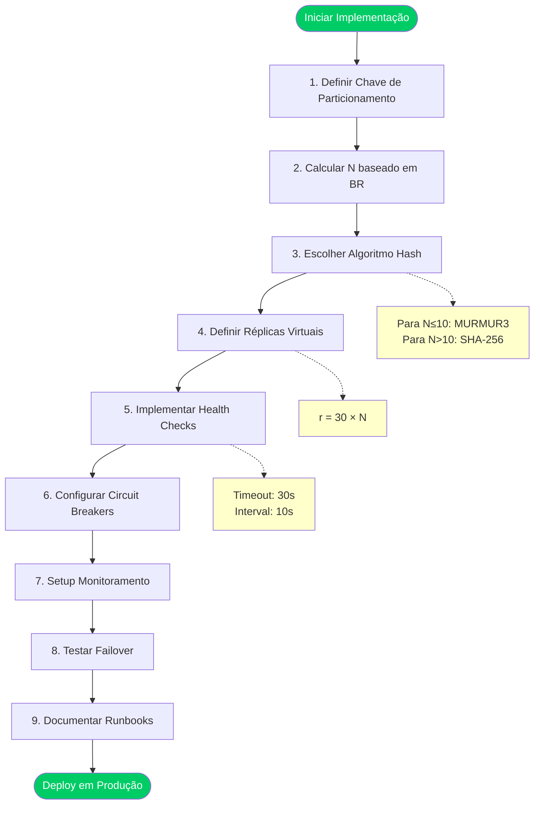

---

## 12. Conclusões

### 12.1 Principais Descobertas

1. **Blast Radius é inversamente proporcional** ao número de células: $BR(N) = \frac{100}{N}\%$

2. **Ponto ótimo**: **N = 5-10** para maioria dos casos
   - BR: 10-20%
   - Complexidade: Gerenciável
   - Custo: Razoável

3. **Retornos decrescentes**: Após N=20, ganhos marginais não justificam complexidade adicional

4. **Dados empíricos confirmam**: Com hash consistente e 150 réplicas virtuais, distribuição é uniforme

### 12.2 Equação Fundamental

$$\boxed{BR(N) = \frac{1}{N} \Rightarrow N = \frac{1}{BR_{target}}}$$

Para atingir BR de 10%: $N = \frac{1}{0.10} = 10$ células.

### 12.3 Recomendação Final

**Configuração Balanceada para Produção**:

```
Células (N): 10
Blast Radius: 10%
Algoritmo Hash: SHA-256
Réplicas Virtuais: 300 (30 × N)
CV Esperado: ~4-5%
Disponibilidade: 99.9%
```

Esta configuração oferece:
- ✅ BR aceitável (10%)
- ✅ Alta resiliência (90% disponível durante falha)
- ✅ Complexidade gerenciável
- ✅ Distribuição uniforme (CV < 5%)
- ✅ Segurança (SHA-256)

---

## Referências

1. **Netflix Engineering**: "Chaos Engineering and Fault Isolation" (2015)
2. **AWS Well-Architected Framework**: "Reliability Pillar - Bulkhead Pattern"
3. **Michael Nygard**: *Release It!* 2nd Edition (2018) - Capítulo sobre Bulkheads
4. **Amazon Builders' Library**: "Avoiding fallback in distributed systems"
5. **Google SRE Book**: Chapter 26 - "Data Integrity: What You Read Is What You Wrote"

---

**Documento gerado**: Dezembro 2025  
**Versão**: 1.0  
**Autor**: Análise para Dissertação de Mestrado em Arquitetura Celular  
**Contexto**: Consolidação de resultados empíricos de benchmark com 1M UUID v4
