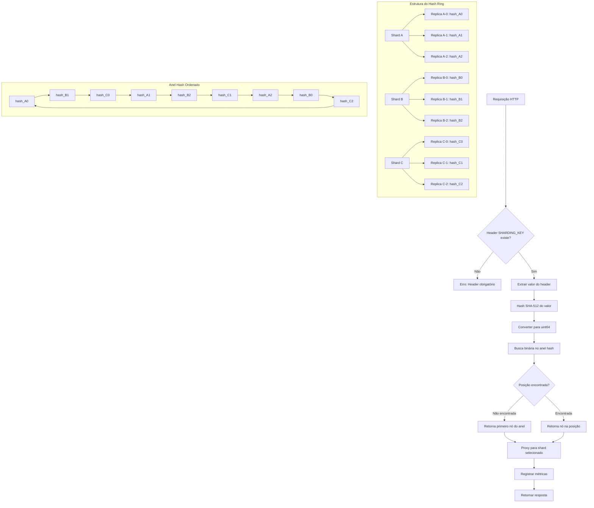
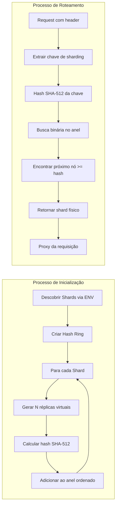

# MSC Notes - Shard Router

Um proxy router baseado em hash consistente para distribuição de requisições entre shards, desenvolvido como parte das POCs do mestrado em arquitetura celular.

## Visão Geral

O **MSC Shard Router** é um componente essencial em arquiteturas distribuídas que implementa os conceitos de:

- **Sharding**: Particionamento horizontal de dados/serviços
- **Hash Consistente**: Distribuição uniforme e estável de chaves entre shards
- **Proxy/Load Balancer**: Roteamento transparente e metrificável de requisições
- **Bulkheads**: Isolamento entre componentes através de shards independentes
- **Resiliência**: Tolerância a falhas através de distribuição de carga consistente e isolamento

## Arquitetura

O projeto implementa um padrão de proxy reverso que utiliza hash consistente para determinar o shard de destino baseado em um header HTTP específico:

```
Cliente → Shard Router → [Hash Consistente] → Shard N
```

### Arquitetura Detalhada

```mermaid
graph TB
    subgraph "Cliente"
        C1[Aplicação Cliente]
        C2[Header: id_client]
    end
    
    subgraph "Shard Router"
        SR1[HTTP Server :8080]
        SR2[Extrator de Header]
        SR3[Hash Ring Engine]
        SR4[Proxy Reverso]
        SR5[Métricas Prometheus]
        
        SR1 --> SR2
        SR2 --> SR3
        SR3 --> SR4
        SR4 --> SR5
    end
    
    subgraph "Shards Backend"
        S1[Shard 01<br/>:8081]
        S2[Shard 02<br/>:8082]
        S3[Shard 03<br/>:8083]
        SN[Shard N<br/>:808N]
    end
    
    subgraph "Observabilidade"
        M1[/metrics endpoint]
        M2[/healthz endpoint]
        M3[Logs estruturados]
    end
    
    C1 --> SR1
    C2 --> SR2
    
    SR4 --> S1
    SR4 --> S2
    SR4 --> S3
    SR4 --> SN
    
    SR5 --> M1
    SR1 --> M2
    SR1 --> M3
    
    style SR3 fill:#e1f5fe
    style C2 fill:#fff3e0
    style S1 fill:#f3e5f5
    style S2 fill:#f3e5f5
    style S3 fill:#f3e5f5
    style SN fill:#f3e5f5
```

## 🔧 Configuração

### Variáveis de Ambiente

| Variável | Descrição | Exemplo |
|----------|-----------|---------|
| `ROUTER_PORT` | Porta do servidor router | `8080` |
| `SHARDING_KEY` | Nome do header HTTP usado para sharding | `id_client` |
| `SHARD_01_URL` | URL do primeiro shard | `http://shard01:80` |
| `SHARD_02_URL` | URL do segundo shard | `http://shard02:80` |
| `SHARD_N_URL` | URLs adicionais seguindo o padrão | `http://shardN:80` |


### Descoberta Dinâmica de Shards

O sistema automaticamente descobre shards através de regex pattern matching das variáveis de ambiente que seguem o padrão `SHARD_(\d+)_URL`.

## 🚀 Execução Local

### Docker Compose (Recomendado)

```bash
docker-compose up -d
```

### Build Manual

```bash
# Build da aplicação
go mod tidy
go build -o main .

# Configuração das variáveis
export ROUTER_PORT=8080
export SHARDING_KEY=id_client
export SHARD_01_URL=http://localhost:8081
export SHARD_02_URL=http://localhost:8082
export SHARD_03_URL=http://localhost:8083

# Execução
./main
```

## Algoritmo de Hash Consistente

### Implementação

O sistema utiliza **SHA-512** para geração de hashes, convertidos para `uint64` para posicionamento no anel. Características:

- **Réplicas Virtuais**: Cada shard físico possui múltiplas réplicas virtuais no anel
- **Distribuição Uniforme**: Minimiza hotspots através de múltiplos pontos no anel
- **Busca Binária**: Localização eficiente O(log n) do shard de destino

### Fluxo de Roteamento

1. **Extração**: Captura do valor do header definido em `SHARDING_KEY`
2. **Hashing**: Cálculo SHA-512 do valor + conversão para uint64
3. **Lookup**: Busca binária no anel ordenado pelo hash
4. **Roteamento**: Proxy da requisição para o shard selecionado

### Diagrama do Hash Consistente



### Algoritmo de Distribuição

O hash consistente implementado segue os seguintes princípios:

1. **Múltiplas Réplicas Virtuais**: Cada shard físico é representado por múltiplas posições no anel hash
2. **Distribuição Uniforme**: As réplicas virtuais minimizam hotspots e garantem distribuição equilibrada
3. **Estabilidade**: Adição/remoção de shards afeta apenas os nós adjacentes no anel
4. **Eficiência**: Busca binária O(log n) para localização do shard de destino



## Endpoints

### Proxy Principal
- **Endpoint**: `/*` - Aceitando qualquer path ou método, todos os componentes do request serão repassados para o shard
- **Método**: Todos os métodos HTTP
- **Funcionalidade**: Roteamento baseado em hash consistente

### Health Check
- **Endpoint**: `/healthz`
- **Método**: GET
- **Resposta**: Status 200 OK

### Métricas Prometheus
- **Endpoint**: `/metrics`
- **Método**: GET
- **Métricas Disponíveis**:
  - `shard_router_requests_total`: Contador de requisições por shard
  - `shard_router_responses_total`: Contador de respostas por shard e status

## Monitoramento

### Métricas Prometheus

```prometheus
# Requisições totais por shard
shard_router_requests_total{shard="http://shard01:80"}

# Respostas por shard e código de status
shard_router_responses_total{shard="http://shard01:80",status="200"}
```

### Logs Estruturados

O sistema produz logs estruturados incluindo:
- Mapeamento de shards durante inicialização
- Roteamento de chaves para hosts específicos
- Status de saúde do servidor

## Exemplo de Uso

```bash
# Requisição com header de sharding
curl -H "id_client: user123" http://localhost:9090/

# A requisição será sempre roteada para o mesmo shard baseado no hash de "user123"
```

## Conceitos Acadêmicos Implementados

### Arquitetura Celular
- **Isolamento**: Cada shard opera independentemente
- **Escalabilidade**: Adição dinâmica de novos shards
- **Tolerância a Falhas**: Falha de um shard não afeta outros

### Bulkheads Pattern
- **Compartimentalização**: Recursos isolados por shard
- **Contenção de Falhas**: Problemas localizados não se propagam

### Consistent Hashing
- **Estabilidade**: Mudanças mínimas na distribuição ao adicionar/remover shards
- **Performance**: Lookup O(log n) com distribuição uniforme

## Stack Utilizada

- **Go 1.23**: Runtime e linguagem
- **Gorilla Mux**: Roteamento HTTP
- **Prometheus**: Métricas e observabilidade
- **Docker**: Containerização
- **Air**: Hot reload para desenvolvimento

## Referências Acadêmicas

- [Consistent Hashing and Random Trees](https://www.akamai.com/us/en/multimedia/documents/technical-publication/consistent-hashing-and-random-trees-distributed-caching-protocols-for-relieving-hot-spots-on-the-world-wide-web-technical-publication.pdf)
- [Building Microservices - Sam Newman](https://samnewman.io/books/building_microservices/)
- [Site Reliability Engineering - Google](https://sre.google/books/)

## Contribuição

Este projeto faz parte de uma pesquisa acadêmica de mestrado sobre arquitetura celular. Contribuições e discussões sobre os conceitos implementados são bem-vindas.