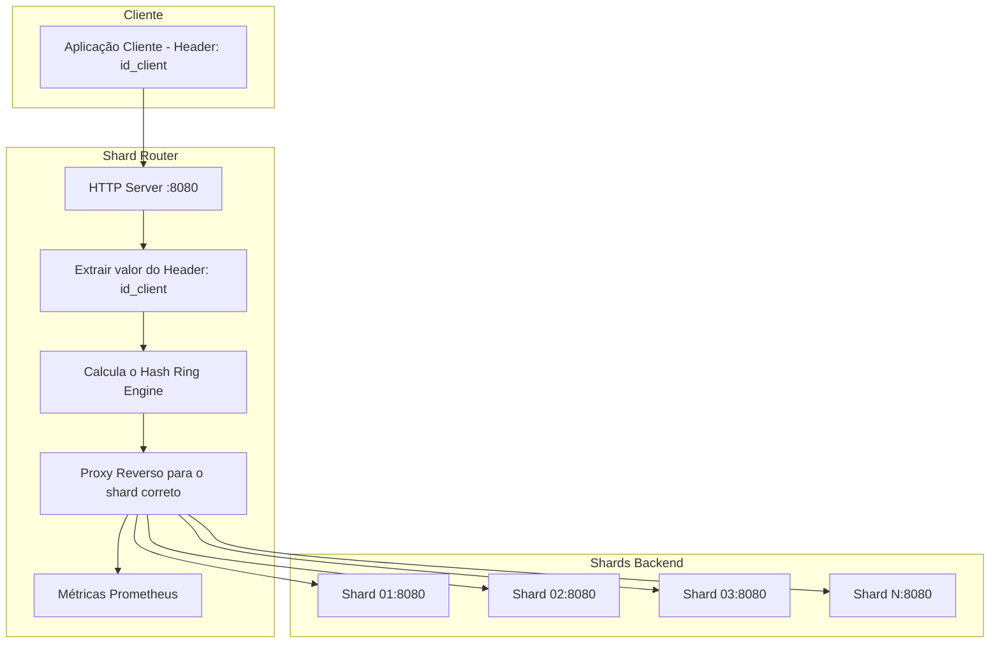
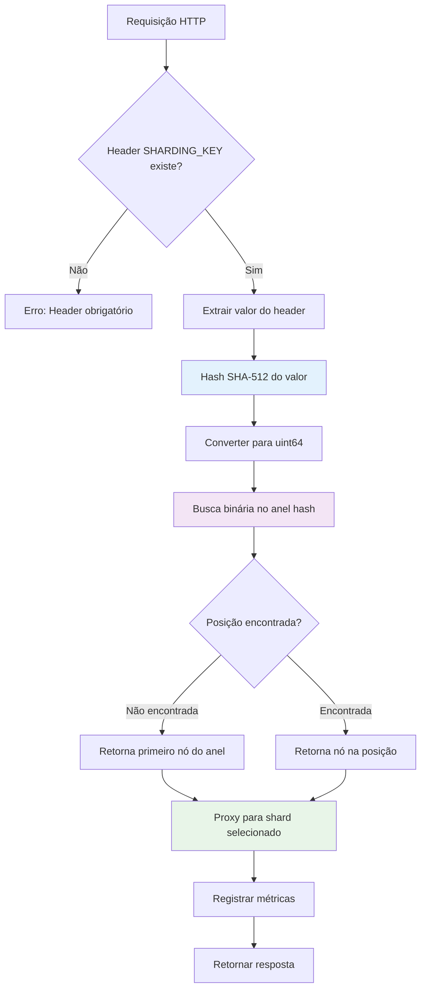
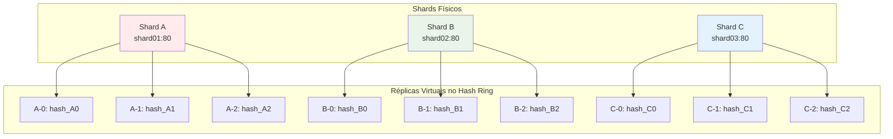
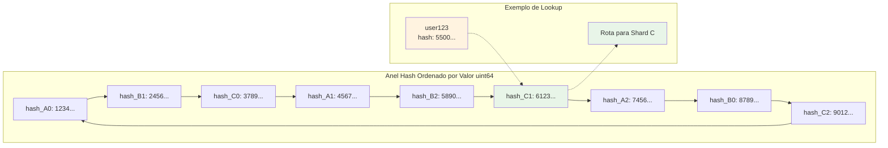
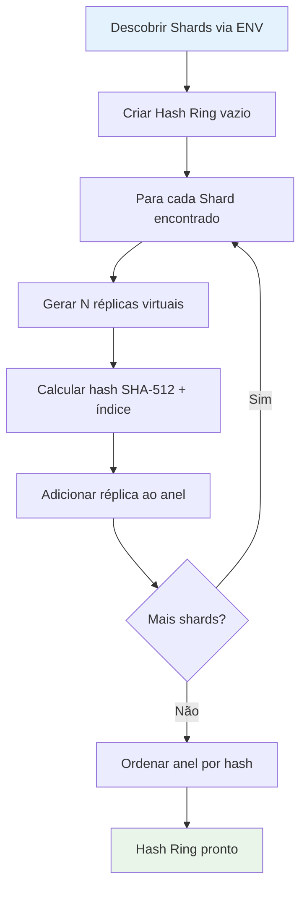
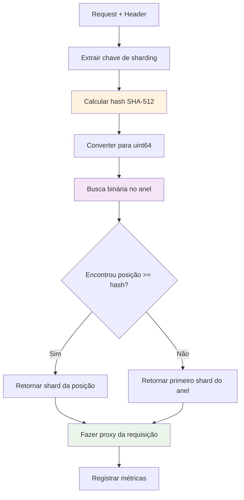

# MSC Notes - Shard Router

[](https://github.com/msfidelis/msc-shard-router/actions/workflows/ci-cd.yml)
[](https://go.dev/)
[](https://github.com/msfidelis/msc-shard-router/actions)
[](https://github.com/msfidelis/msc-shard-router/security)
[](https://github.com/msfidelis/msc-shard-router/actions/workflows/performance.yml)
[](LICENSE)

Um proxy router baseado em hash consistente para distribuição de requisições entre shards, desenvolvido como parte das POCs do mestrado em arquitetura celular.

## Visão Geral

O **MSC Shard Router** é um componente essencial em arquiteturas distribuídas que implementa os conceitos de:

- **Sharding**: Particionamento horizontal de dados/serviços
- **Hash Consistente**: Distribuição uniforme e estável de chaves entre shards
- **Proxy/Load Balancer**: Roteamento transparente e metrificável de requisições
- **Bulkheads**: Isolamento entre componentes através de shards independentes
- **Resiliência**: Tolerância a falhas através de distribuição de carga consistente e isolamento

## Arquitetura

O projeto implementa um padrão de proxy reverso que utiliza hash consistente para determinar o shard de destino baseado em um header HTTP específico:

```
Cliente → Shard Router → [Hash Consistente] → Shard N
```

### Arquitetura Detalhada



## 🔧 Configuração

### Variáveis de Ambiente

| Variável | Descrição | Exemplo | Padrão |
|----------|-----------|---------|---------|
| `ROUTER_PORT` | Porta do servidor router | `8080` | `8080` |
| `SHARDING_KEY` | Nome do header HTTP usado como shard key | `id_client` | `id_client` |
| `HASHING_ALGORITHM` | Algoritmo de hash para consistent hashing | `SHA512` | `SHA512` |
| `SHARD_01_URL` | URL do primeiro shard | `http://shard01:80` | - |
| `SHARD_02_URL` | URL do segundo shard | `http://shard02:80` | - |
| `SHARD_N_URL` | URLs adicionais seguindo o padrão | `http://shardN:80` | - |

### Algoritmos de Hash Suportados

| Algoritmo | Variável | Segurança | Performance | Recomendação |
|-----------|----------|-----------|-------------|--------------|
| **SHA-512** | `SHA512` | 🔒 Máxima | ⚡ Boa | 🎯 **Produção** |
| **SHA-256** | `SHA256` | 🔒 Alta | ⚡ Muito Boa | 🚀 **Performance** |
| **SHA-1** | `SHA1` | ⚠️ Moderada | ⚡ Boa | 🧪 **Legado** |
| **MD5** | `MD5` | ❌ Baixa | ⚡ Muito Boa | 🧪 **Desenvolvimento** |
| **Murmur3** | `MURMUR` | ❌ Nenhuma | 🚀 Máxima | ⚡ **Não-criptográfico** |

**Exemplo de configuração:**
```bash
export HASHING_ALGORITHM=SHA256  # Para melhor performance
export HASHING_ALGORITHM=MURMUR  # Para máxima velocidade
export HASHING_ALGORITHM=SHA512  # Para máxima segurança (padrão)
```


### Descoberta Dinâmica de Shards

O sistema automaticamente descobre shards através de regex pattern matching das variáveis de ambiente que seguem o padrão `SHARD_(\d+)_URL`.

## Algoritmo de Hash Consistente

### Implementação

O sistema utiliza **SHA-512** para geração de hashes, convertidos para `uint64` para posicionamento no anel. Características:

- **Réplicas Virtuais**: Cada shard físico possui múltiplas réplicas virtuais no anel
- **Distribuição Uniforme**: Minimiza hotspots através de múltiplos pontos no anel
- **Busca Binária**: Localização eficiente O(log n) do shard de destino

### Fluxo de Roteamento

1. **Extração**: Captura do valor do header definido em `SHARDING_KEY`
2. **Hashing**: Cálculo SHA-512 do valor + conversão para uint64
3. **Lookup**: Busca binária no anel ordenado pelo hash
4. **Roteamento**: Proxy da requisição para o shard selecionado

### Diagrama do Hash Consistente

#### 1. Fluxo de Processamento da Requisição



#### 2. Estrutura das Réplicas Virtuais



#### 3. Anel Hash Consistente (Visão Circular)



### Algoritmo de Distribuição

O hash consistente implementado segue os seguintes princípios:

1. **Múltiplas Réplicas Virtuais**: Cada shard físico é representado por múltiplas posições no anel hash
2. **Distribuição Uniforme**: As réplicas virtuais minimizam hotspots e garantem distribuição equilibrada
3. **Estabilidade**: Adição/remoção de shards afeta apenas os nós adjacentes no anel
4. **Eficiência**: Busca binária O(log n) para localização do shard de destino

#### Processo de Inicialização do Hash Ring



#### Processo de Roteamento de Requisições



## Endpoints

### Proxy Principal
- **Endpoint**: `/*` - Aceitando qualquer path ou método, todos os componentes do request serão repassados para o shard
- **Método**: Todos os métodos HTTP
- **Funcionalidade**: Roteamento baseado em hash consistente

### Health Check
- **Endpoint**: `/healthz`
- **Método**: GET
- **Resposta**: Status 200 OK

### Métricas Prometheus
- **Endpoint**: `/metrics`
- **Método**: GET
- **Métricas Disponíveis**:
  - `shard_router_requests_total`: Contador de requisições por shard
  - `shard_router_responses_total`: Contador de respostas por shard e status

## Monitoramento

### Métricas Prometheus

```prometheus
# Requisições totais por shard
shard_router_requests_total{shard="http://shard01:80"}

# Respostas por shard e código de status
shard_router_responses_total{shard="http://shard01:80",status="200"}
```

### Logs Estruturados

O sistema produz logs estruturados incluindo:
- Mapeamento de shards durante inicialização
- Roteamento de chaves para hosts específicos
- Status de saúde do servidor

## Exemplo de Uso

```bash
# Requisição com header de sharding
curl -H "id_client: user123" http://localhost:9090/

# A requisição será sempre roteada para o mesmo shard baseado no hash de "user123"
```

## Conceitos Acadêmicos Implementados

### Arquitetura Celular
- **Isolamento**: Cada shard opera independentemente
- **Escalabilidade**: Adição dinâmica de novos shards
- **Tolerância a Falhas**: Falha de um shard não afeta outros

### Bulkheads Pattern
- **Compartimentalização**: Recursos isolados por shard
- **Contenção de Falhas**: Problemas localizados não se propagam

### Consistent Hashing
- **Estabilidade**: Mudanças mínimas na distribuição ao adicionar/remover shards
- **Performance**: Lookup O(log n) com distribuição uniforme

## Stack Utilizada

- **Go 1.25**: Runtime e linguagem
- **Gorilla Mux**: Roteamento HTTP
- **Prometheus**: Métricas e observabilidade
- **Docker**: Containerização
- **Air**: Hot reload para desenvolvimento

## 🏗️ Arquitetura Testável

O projeto foi refatorado seguindo princípios de **Clean Architecture** e **Dependency Injection** para maximizar a testabilidade:

### Interfaces e Abstrações

```go
// Principais interfaces para testabilidade
type HashRing interface {
    AddNode(nodeID string)
    GetNode(key string) string
}

type ShardRouter interface {
    GetShardingKey(r *http.Request) string
    GetShardHost(key string) string
    InitHashRing(size int)
    AddShard(shardHost string)
}

type ConfigManager interface {
    LoadShards() ([]Shard, error)
    GetShardingKey() string
}
```

### Benefícios da Arquitetura

- **Testabilidade**: Mocking fácil de dependências através de interfaces
- **Injeção de Dependência**: Componentes desacoplados e testáveis isoladamente
- **Separation of Concerns**: Cada package tem responsabilidade única
- **Facilidade de Manutenção**: Código modular e bem estruturado

### Padrões Implementados

- **Repository Pattern**: Para configuração de shards
- **Strategy Pattern**: Para algoritmos de hash
- **Dependency Injection**: Para testabilidade
- **Interface Segregation**: Interfaces pequenas e focadas


## 🚀 Execução Local

### Docker Compose (Recomendado)

```bash
# Subir todos os serviços
make docker-compose-up

# Ou manualmente:
docker-compose up -d
```

### Build Manual

```bash
# Build da aplicação
make build

# Ou manualmente:
go mod tidy
go build -o shard-router .

# Configuração das variáveis
export ROUTER_PORT=8080
export SHARDING_KEY=id_client
export SHARD_01_URL=http://localhost:8081
export SHARD_02_URL=http://localhost:8082
export SHARD_03_URL=http://localhost:8083

# Execução
make run
```

## Testes

O projeto possui uma suite completa de testes unitários com alta cobertura:

### Executar Testes

```bash
# Todos os testes
make test

# Testes com coverage
make test-coverage

# Testes verbosos
make test-verbose

# Benchmarks
make benchmark
```

### Estrutura de Testes

- **`pkg/hashring/main_test.go`**: Testes do algoritmo de hash consistente
- **`pkg/sharding/main_test.go`**: Testes do roteamento de shards
- **`pkg/setup/main_test.go`**: Testes da configuração e descoberta de shards
- **`main_test.go`**: Testes dos handlers HTTP e integração


### Testes de Integração

```bash
# Testa o sistema completo com Docker Compose
make test-integration
```

## Referências Acadêmicas

- [Consistent Hashing and Random Trees](https://www.akamai.com/us/en/multimedia/documents/technical-publication/consistent-hashing-and-random-trees-distributed-caching-protocols-for-relieving-hot-spots-on-the-world-wide-web-technical-publication.pdf)
- [Building Microservices - Sam Newman](https://samnewman.io/books/building_microservices/)
- [Site Reliability Engineering - Google](https://sre.google/books/)


## Contribuição

Este projeto faz parte de uma pesquisa acadêmica de mestrado sobre arquitetura celular. Contribuições e discussões sobre os conceitos implementados são bem-vindas.